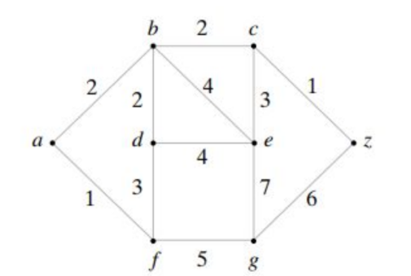

# Algoritmo Dijkstra Python

El algoritmo de Dijkstra, también llamado algoritmo de caminos mínimos, es un algoritmo para la determinación del camino más corto, dado un vértice de origen hasta un vertice final en un grafo que tiene pesos en cada arista.

La idea de este algoritmo consiste en ir explorando el camino mas corto que parte del vértice de origen hasta el vertice final; cuando se obtiene el camino más corto, el algoritmo se detiene. Se trata de una especialización de la búsqueda de costo uniforme y, como tal, no funciona en grafos con aristas de coste negativo (al elegir siempre el nodo con distancia menor, puede quedar excluido de la búsqueda de nodos que en próximas iteraciones bajarían el costo general del camino al pasar por una arista con costo negativo).

**Grafo utilizado**

