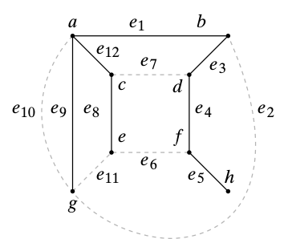

# Metodo Busqueda Anchura Python

Es un algoritmo de búsqueda no informada utilizado para recorrer o buscar elementos en un grafo.
Normalmente se comienza en la raíz y se exploran todos los nodos vecinos de este nodo. A continuación para cada uno de los vecinos se exploran sus respectivos vecinos adyacentes, y así hasta que se recorra todo el grafo.

**Grafo utilizado**

